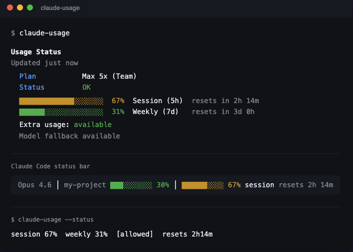

# claude-usage

> **Disclaimer:** Unofficial, community-built tool. Not affiliated with, endorsed by, or sponsored by Anthropic. "Claude" and "claude.ai" are trademarks of Anthropic, PBC.
>
> **100% vibecoded.** This entire tool was written by Claude. The author takes no responsibility for anything — use at your own risk.

See your Claude and Codex usage limits in real time. Works anywhere — terminal, status bar, scripts.



Claude data comes from a 1-token API call against Anthropic's headers. Codex data comes from your local Codex installation, using the app-server when possible and falling back to recent local Codex session snapshots.

## Quick install

**macOS (Apple Silicon):**
```bash
curl -fsSL https://github.com/Dede98/claude-usage/releases/latest/download/claude-usage-darwin-arm64 \
  -o /usr/local/bin/claude-usage && chmod +x /usr/local/bin/claude-usage
claude-usage install --daemon
```

**macOS (Intel):**
```bash
curl -fsSL https://github.com/Dede98/claude-usage/releases/latest/download/claude-usage-darwin-amd64 \
  -o /usr/local/bin/claude-usage && chmod +x /usr/local/bin/claude-usage
claude-usage install --daemon
```

**Linux (amd64 / arm64):**
```bash
curl -fsSL https://github.com/Dede98/claude-usage/releases/latest/download/claude-usage-linux-amd64 \
  -o /usr/local/bin/claude-usage && chmod +x /usr/local/bin/claude-usage
```

> Note: `install --daemon` uses macOS launchd. On Linux, run `claude-usage --daemon &` or create a systemd unit manually.

Drop `--daemon` if you only want manual refresh:

```bash
claude-usage install
```

## How it works

1. Claude: reads your OAuth token from macOS Keychain and makes a minimal API call
2. Claude: parses `anthropic-ratelimit-unified-*` response headers for live limit data
3. Codex: reads local subscription limit state from Codex
4. Writes a combined snapshot to `~/.claude/usage-data.json` for other tools to consume

## Usage

```bash
claude-usage              # Refresh providers, show formatted output
claude-usage --json       # Refresh providers, output JSON
claude-usage --watch      # Live refresh every 60s
claude-usage --daemon     # Background mode: refresh + write to file
claude-usage --read       # Display from cached file (no API call)
claude-usage --status     # One-line summary for scripting
```

### Usage guard

Watch a process and automatically pause it when rate limits get too high:

```bash
claude-usage guard --pid 12345                # Watch a specific PID
claude-usage guard --pid-file .gsd/auto.lock  # Watch PID from lock file
claude-usage guard status                     # Show current usage + guard state
```

The guard monitors both session (5h) and weekly (7d) limits, showing them side by side. When usage exceeds the threshold (default 80%), it sends SIGTERM to the watched process. When usage drops back down, it notifies you.

```bash
# Options
claude-usage guard --pid-file .gsd/auto.lock \
  --threshold 90      # Pause at 90% (default: 80)
  --warn 80           # Warn at 80% (default: threshold - 10)
  --poll 15           # Poll every 15s (default: 30)
  --auto-resume       # Notify when safe to resume
  --dry-run           # Log actions without killing
  --quiet             # Suppress routine output
```

The display updates in place — routine polls overwrite the same line, only state changes (warnings, pauses) get their own timestamped line.

Supports both plain PID files (`12345`) and JSON lock files (`{"pid": 12345}`) for compatibility with tools like GSD.

### Claude Code status bar

The `install` command automatically configures your Claude Code status bar:

```
██████████████░░░░░░ 67% session  resets 2h 14m
```

If you already have a statusline configured, it wraps the existing one — nothing breaks.

To configure manually, add to `~/.claude/settings.json`:

```json
{
  "statusLine": {
    "type": "command",
    "command": "claude-usage statusline"
  }
}
```

Or to wrap an existing statusline:

```json
{
  "statusLine": {
    "type": "command",
    "command": "claude-usage statusline --wrap \"node ~/.claude/hooks/my-statusline.js\""
  }
}
```

Colors change automatically: green (< 50%), yellow (< 80%), red (>= 80%). Weekly usage appears when >= 75%.

### Codex CLI status line

Codex has its own native status line. This tool does **not** inject a custom command into Codex the way it does for Claude Code.

Recommended setup inside Codex:

1. Run `/statusline`
2. Enable these built-in items:
   - `Remaining usage on 5-hour usage limit`
   - `Remaining usage on weekly usage limit`
3. Optionally also enable:
   - `Current model name with reasoning level`
   - `Percentage of context window remaining`
   - `Total tokens used in session`

This is the preferred Codex setup because it uses Codex's native status line and live limit data directly.

### Background daemon

The `install --daemon` command sets up a launchd service for continuous polling:

```bash
# Manual daemon management
launchctl list com.claude-usage.daemon    # Check status
launchctl unload ~/Library/LaunchAgents/com.claude-usage.daemon.plist  # Stop
launchctl load ~/Library/LaunchAgents/com.claude-usage.daemon.plist    # Start
```

### Scripting

The `--status` flag outputs one line per available provider, useful for tmux, polybar, or other status bars:

```bash
$ claude-usage --status
claude used 67%  weekly used 31%  [allowed]  resets 2h14m
codex  5h left 81%  weekly left 56%  [plus]  resets 4h3m
```

## Data format

The tool writes `~/.claude/usage-data.json` with this schema:

```jsonc
{
  "version": 2,
  "timestamp": 1711882800000,        // Unix ms when fetched
  "providers": {
    "claude": {
      "timestamp": 1711882800000,
      "source": "api",
      "auth": {
        "account_type": "oauth",
        "subscription_type": "team",
        "rate_limit_tier": "default_claude_max_5x",
        "token_expires_at": 1774996245508
      },
      "limits": {
        "primary": {
          "utilization": 0.67,
          "utilization_pct": 67,
          "resets_at": 1711890000,
          "window_minutes": 300
        },
        "secondary": {
          "utilization": 0.31,
          "utilization_pct": 31,
          "resets_at": 1712300000,
          "window_minutes": 10080
        },
        "status": "allowed"
      },
      "error": null
    },
    "codex": {
      "timestamp": 1711882804000,
      "source": "codex_app_server",
      "auth": {
        "account_type": "chatgpt",
        "plan_type": "plus"
      },
      "limits": {
        "limit_id": "codex",
        "primary": {
          "utilization_pct": 19,
          "resets_at": 1711890000,
          "window_minutes": 300
        },
        "secondary": {
          "utilization_pct": 44,
          "resets_at": 1712300000,
          "window_minutes": 10080
        },
        "credits": {
          "has_credits": true,
          "unlimited": false,
          "balance": "141.86"
        }
      },
      "error": null
    }
  }
}
```

**Key fields for integrations:**

| Path | Type | Description |
|------|------|-------------|
| `version` | `number` | Current schema version is `2`. |
| `timestamp` | `number` | Unix ms. Data older than 5 min is stale. |
| `providers.<name>.limits.primary.utilization_pct` | `number` | Raw primary window usage 0-100% |
| `providers.<name>.limits.primary.resets_at` | `number` | Unix epoch seconds |
| `providers.<name>.limits.secondary.utilization_pct` | `number` | Secondary window usage 0-100% |
| `providers.claude.auth.rate_limit_tier` | `string` | Claude subscription tier |
| `providers.codex.auth.plan_type` | `string` | Codex ChatGPT plan |
| `providers.<name>.error` | `string\|null` | Error if provider refresh failed |

## Build on top of it

The daemon writes a simple JSON file. That's your API. Build whatever you want on top of it — menu bar apps, Raycast extensions, Slack bots, dashboard widgets, IDE plugins, Home Assistant automations. Go wild.

See [INTEGRATIONS.md](INTEGRATIONS.md) for the full integration guide — JSON schema, code examples (Python, Node.js, Go, Swift, Bash), statusline wrapping, and ready-to-paste AI context. Paste it into Claude or any AI assistant and it has everything it needs to build your integration.

## Requirements

- macOS or Linux
- Claude Code installed and logged in (`claude /login`) if you want Claude data
- Codex installed and logged in with ChatGPT if you want Codex data
- macOS: Claude auth is read from Keychain automatically

## How it authenticates

Claude auth is read from the macOS Keychain (service: `Claude Code-credentials`) and used for a minimal Anthropic API call.

Codex usage is read from your local Codex installation via Codex's local app-server interface, with recent local session data as a fallback if needed.

## Uninstall

```bash
claude-usage uninstall
```

This stops the daemon, restores your original statusline, and removes the symlink. The data file (`~/.claude/usage-data.json`) is preserved.

## Build from source

```bash
git clone https://github.com/Dede98/claude-usage.git
cd claude-usage
go build -o claude-usage .
./claude-usage install --daemon
```

## License

MIT
